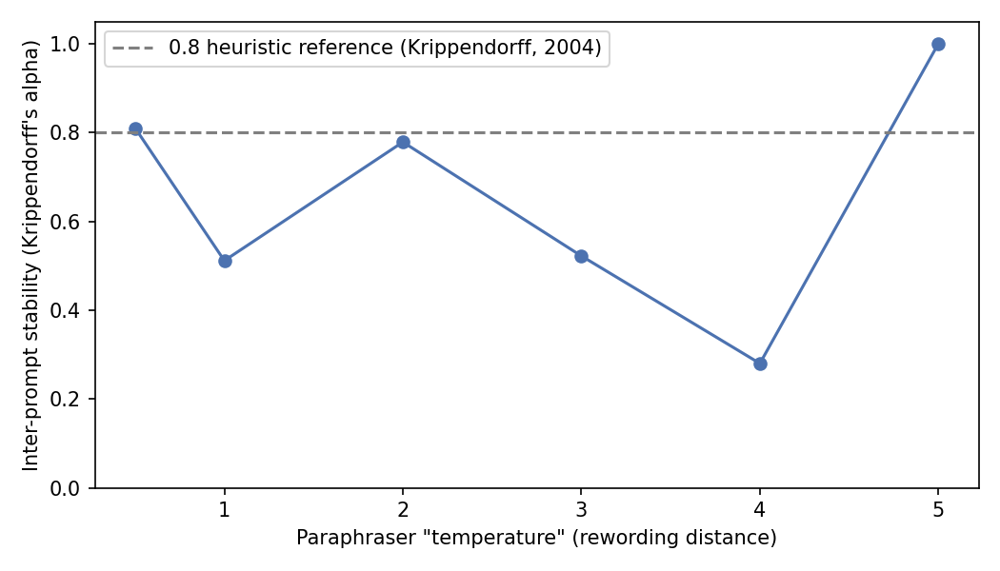
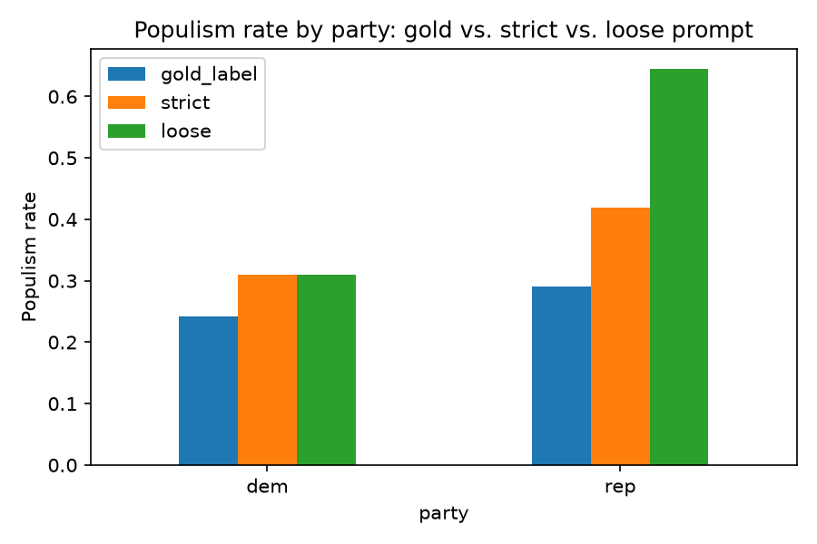

## The Promise {background-color="white"}

::: {.keybox}
Large language models can **annotate text at scale** — coding thousands of manifestos, tweets, or survey responses in minutes, at a tiny fraction of the cost of human coders or crowdworkers.
:::

::: {.incremental}
- Political science has produced **almost no work** on replication and research-transparency standards for LLM-based studies [@barrie2024replication]
- Meanwhile LLMs are already being used *as if* they were just another (better, cheaper) coder
- This talk asks: what does it mean for an LLM-based study to **replicate** — and can we test that, rather than just hope for it?
:::

::: {.notes}
Open by acknowledging the appeal directly — this isn't a talk arguing LLMs are bad for research. It's a talk about what "replication" even means once your coder is a model you don't fully control, and how to check whether your own pipeline is trustworthy before you build a paper on it. Everything from here is either a finding from one of the two papers, or (clearly marked) our own synthesis.
:::

---

## Paper 1

![Title page and abstract, Paper 1 [@barrie2024promptstability]](figures/paper_promptstability_titlepage.png){height="620px" fig-alt="Title page of Prompt Stability Scoring for Text Annotation with Large Language Models, showing the abstract describing the Prompt Stability Score and the promptstability package"}

::: {.notes}
Note the title page prints no author names on Paper 1 itself — the attribution used throughout this talk (Barrie, Palaiologou & Törnberg) comes from Paper 2's own bibliography, not from this page. Read a line or two of the abstract aloud if useful: the core claims (stability is necessary but not sufficient; ~3.1M annotations; six datasets, twelve outcomes) are all here in the paper's own words.
:::

---

## Paper 2

![Title page and abstract, Paper 2 [@barrie2024replication]](figures/paper_replication_titlepage.png){height="620px" fig-alt="Title page of Replication for Large Language Models: Problems, Principles, and Best Practices for Political Science, showing the abstract describing the rolling iterated replication design"}

::: {.notes}
Point out the abstract's own framing: "LLMs can be accurate, but the observed variance in performance is often unacceptably high. Strict temperature control does not resolve these issues." That sentence previews Findings 2 and 3 almost exactly — worth flagging before we get there.
:::

---

## Two Papers, One Question

Two companion papers, both asking whether LLM-based annotation can be trusted to replicate:

::: {.incremental}
- **Paper 1** (Barrie, Palaiologou & Törnberg): a diagnostic **tool** — can you tell, cheaply, whether a pipeline is fragile? [@barrie2024promptstability]
- **Paper 2** (Barrie, Palmer & Spirling): an empirical **audit** — repeated LLM replications over a year, tracking what actually breaks [@barrie2024replication]
- **Shared logic**: both repurpose human inter-coder reliability approaches for a new kind of "rater" — the LLM
- **This talk**: the diagnostic's mechanics, the empirical evidence, a synthesis — then you try both yourselves
:::

::: {.notes}
Christopher Barrie is a co-author on both papers — Paper 2 explicitly cites Paper 1's tool as one of its own recommendations, with the caveat that a stability check alone doesn't solve the deeper closed-model replication problem. Frame this as "same worry, two angles": one gives you a pre-flight check you can run on your own pipeline; the other tells you, empirically and at scale, how bad things get if you skip it.
:::

---

## Three Traditions of Replication

Political science already has three visions of what "replication" means [@barrie2024replication]:

:::::: {.columns}

::: {.column width="32%"}
::: {.fragment}
**Deterministic**

Same data + code → identical results. *Exact*, but fragile — depends on system version.
:::
:::

::: {.column width="32%"}
::: {.fragment}
**Stochastic**

Independent re-annotation converges statistically. Not exact, but *robust* to who codes.
:::
:::

::: {.column width="32%"}
::: {.fragment}
**Rule-based**

A fully explicit coding rule (e.g. Key's 1949 "the South"). Exact *and* robust.
:::
:::

::::::

::: {.fragment}
::: {.resultbox}
**The core problem:** LLM-based annotation exhibits the *weaknesses* of all three traditions — without the *strengths* of any of them [@barrie2024replication].
:::
:::

::: {.notes}
This is Paper 2's central typology (their Table 1). Reveal the three traditions one at a time, letting each land before moving on, then the punchline: LLMs are not exactly reproducible (unlike deterministic code), not obviously system-independent (unlike stochastic crowd designs), and not reducible to a fully explicit rule (unlike Key's "the South"). The next slide gives the statistical mechanics of Paper 1's diagnostic tool; the four after that are the empirical evidence, one fragility axis at a time, each with the paper's own real figures.
:::

---

## How Prompt Stability Scoring Works

::: {.methodbox}
Paper 1's trick: treat repeated LLM runs — or reworded prompts — **as if they were multiple human raters** [@barrie2024promptstability].
:::

::: {.incremental}
- **Krippendorff's alpha**: $\alpha = 1 - D_o/D_e$ — 1 is perfect agreement, 0 is chance-level
- **Intra-PSS**: identical prompt run **30 times**; $\alpha$ computed across repeated runs
- **Inter-PSS**: **10 paraphrased variants** per "temperature" (0.1–5.0); $\alpha$ across variants
- **Confidence intervals**: nonparametric bootstrap — resample records, recompute $\alpha$, repeat
:::

::: {.notes}
The elegant move here is purely conceptual: nothing about Krippendorff's alpha cares whether the "raters" are humans, repeated LLM calls, or reworded prompts sent to the same LLM. Paper 1 just points the same reliability statistic at a new kind of rater. Intra-PSS and inter-PSS are the identical computation with a different definition of "rater" — the same package, and the same `bootstrap_krippendorff` routine, computes both. One detail worth mentioning if asked: the distance function inside alpha matches the outcome type — nominal (simple mismatch) for categorical labels, interval (squared difference) for ordinal scales like the 10-point ideology score. Next two slides show what this looks like empirically.
:::

---

## Finding 1: Prompt Wording Changes the Labels

Same real outcome ("MII, Long" — UK survey most-important-issue coding), scored with the statistic just described. Same prompt, repeated 30 times:

![Paper 1, Figure 1 (intra-PSS), MII (Long) [@barrie2024promptstability]](figures/paper1_fig1_intra_mii_long.png){height="520px" fig-alt="Line chart of intra-prompt stability for MII (Long) across 30 iterations, settling around 0.92"}

::: {.notes}
This is a real crop from Paper 1's actual Figure 1, for the dataset-outcome pairing MII (Long). Same prompt run 30 times — settles just above 0.90. Next slide shows the same outcome under reworded prompts, for contrast.
:::

---

## Finding 1 (continued): Reworded, Across "Temperature"

Same outcome (MII, Long), same statistic — now the prompt is paraphrased at increasing "temperature" (0–5) instead of repeated verbatim:

![Paper 1, Figure 2 (inter-PSS), MII (Long) [@barrie2024promptstability]](figures/paper1_fig2_inter_mii_long.png){height="520px" fig-alt="Line chart of inter-prompt stability for MII (Long) swinging between about 0.85 and 0.05 as paraphraser temperature rises from 0 to 5, averaging 0.44"}

::: {.notes}
Same prompt reworded at increasing paraphraser "temperature" (x-axis 0-5) — oscillates wildly, dropping as low as 0.05, averaging 0.44. The paper's own worked examples: for some outcomes (like MII) this instability turned out to be a formatting/parsing artifact; for others (like Synthetic Short) it persisted even after cleaning, because the task itself lacked enough signal. Same symptom, different causes — that diagnostic distinction is exactly what Module 1 will have participants practice.
:::

---

## Finding 2: Model & Version Choice Changes Accuracy *and* Variance

Paper 2 compared crowdworkers, GPT, Gemini, and Llama on the same manifesto task, across eleven monthly iterations [@barrie2024replication].

::: {.fragment}
![Paper 2, Figure 1, Panels A–B ("Manifestos, static") [@barrie2024replication]](figures/paper2_fig1_manifestos_accuracy_variance.png){height="520px" fig-alt="Two dot plots: left shows F1 accuracy across runs by coder (Llama, OpenAI, Crowd, Gemini) for Ideology score and Economic vs Social outcomes; right shows run-to-run variability (SD of F1) for the same coders and outcomes, with Gemini clearly the most variable"}
:::


::: {.notes}
This is the actual Paper 2 figure, not a recreation. Panel A: no coder wins outright on accuracy — task-dependent. Panel B is the more consistent story: Llama and OpenAI are tight/low-variance across repeated monthly runs; Gemini is visibly the most spread out on both outcomes. And this isn't hypothetical — it happened during Paper 2's actual data collection: a vendor deprecated a model version and forced a tier change mid-study. That's a genuinely new kind of fragility relative to a fixed R script.
:::

---

## Finding 3: "Temperature = 0" Is Not Determinism

The intuitive fix for instability is "set temperature to 0." Paper 2 tested this directly [@barrie2024replication].

::: {.fragment}
![Paper 2, Figure 2, Panel B (`gpt-4o-2024-08-06`, temp = 0) [@barrie2024replication]](figures/paper2_fig2_temp0_ideology_panelB.png){height="520px" fig-alt="Density plot of between-run correlations for Ideology score at temperature zero, ranging from about 0.83 to 1.00, above a correlation matrix across 20 runs that is not uniformly black (perfectly correlated)"}
:::

::: {.notes}
This slide often surprises people who've internalized "temperature 0 = deterministic" from general ML folklore. The density plot shows run-to-run correlations bunched near 1.0 but with real mass down around 0.83-0.87 — and the triangular matrix below it (Run 1 through Run 20) visibly has lighter, lower-correlation cells scattered throughout rather than being solid black. It's true for a model you run yourself with a pinned version — it is not guaranteed true for a vendor API, even when the vendor exposes a temperature parameter at all (some current model families don't let you change it anymore).
:::

---

## Finding 4: Annotation Choices Flip Downstream Conclusions

Paper 2 re-coded Hopkins et al.'s ~6.6k identity-cued headlines with three OpenAI models, then re-ran the original regressions [@barrie2024replication].

::: {.fragment}
![Paper 2, Figure 5, Panel C (P-values, original vs. re-estimated) [@barrie2024replication]](figures/paper2_fig5_identity_panelC_pvalues.png){height="240px" fig-alt="Dot plot of p-values for the Gender and Race coefficients across three OpenAI models and three regression specifications; Gender p-values cluster near zero (significant) while the original (dashed line) sits well above 0.05; Race p-values are mostly above 0.05 (red, not significant) while the original sits near the significance threshold"}
:::

::: {.fragment}
::: {.resultbox}
Gender: not significant originally, **significant for every model** tested. Race: the reverse.
:::
:::

::: {.notes}
This is the slide that should land hardest, and it's the real figure. Left side (Gender coefficient): the dashed line marking the original human-coded p-value sits out past 0.15-0.2 (not significant); every black dot (all three models, all three specifications: level/log/ratio) sits near zero — significant every time. Right side (Race coefficient): mostly red dots above the 0.05 line — not significant for the LLM-coded versions, despite the original being closer to the boundary. Same texts, same regression specification — the conclusion changed depending only on who (or what) produced the annotations. This motivates Module 2 directly: participants will manufacture a small version of exactly this effect themselves.
:::

---

## Putting It Together

A practical robustness workflow combining both papers' tools:

::: {.incremental}
1. **PSS pre-check** — run intra-/inter-PSS before investing further
2. **Validate a subsample** against expert or gold-standard codes
3. **Sweep models and versions** — does the finding survive?
4. **Prefer open, versioned models** where the task allows it
5. **Document everything** — model, version, prompt, settings, date run

:::

::: {.notes}
Make explicit that this five-step workflow is our synthesis of the two papers for teaching purposes — it is not a diagram either paper prints. Step 1 comes from Paper 1's PSS Playbook; steps 2, 4, and 5 come from Paper 2's practitioner recommendations; step 3 generalizes Paper 2's own multi-model design (Figure 1) into a check anyone can run. Reveal one step at a time and pause on each.
:::

---

## A Field-Wide Checklist, Not Just This Talk's {.smaller}

This isn't just a two-paper synthesis — a large, cross-disciplinary author group (Christopher Barrie and Arthur Spirling among them) recently proposed a consensus reporting checklist for exactly this problem, across the behavioural sciences:

[{height="520px" fig-alt="Nature Human Behaviour comment article, 'A reporting checklist for large language models in behavioural science,' by Stefan Feuerriegel, Christopher Barrie, and many co-authors, published 9 June 2026"}](https://www.nature.com/articles/s41562-026-02492-7)

::: {.notes}
Click through to the live article if presenting online. This checklist is the field-level, consensus version of the same instinct behind our five-step workflow on the previous slide: standardize what gets reported (model, version, prompt, decoding settings, validation) so LLM-based behavioural-science findings can actually be checked and replicated. Worth noting Paper 2 itself cites an earlier version of this checklist effort in its own recommendations.
:::

---

## From Findings to Practice

We've just walked through four documented fragility patterns. Now you'll manufacture small, safe versions of two of them yourselves:

:::::: {.columns}

::: {.column width="48%"}
::: {.fragment}
**Module 1** recreates Finding 1 (prompt wording) on a real manifesto-coding prompt.
:::
:::

::: {.column width="48%"}
::: {.fragment}
**Module 2** recreates Finding 4 (downstream inference) on a real populism-coding task.
:::
:::

::::::

::: {.fragment}
Both run **offline by default** — no API key needed, no cost, instant feedback — with an optional real-API path for groups who want to see it with a live model.
:::

::: {.notes}
Bridge slide. From here we walk through the actual code participants will run, not just the concept.
:::

---

## Module 1 Preview: Prompt Stability

The **actual** `promptstability` package, pointed at a small model running locally via Ollama — no API key, structured JSON output:

::: {.fragment}
```python
from promptstability import PromptStabilityAnalysis

def annotate_ollama(text, prompt):
    r = ollama.chat(model="llama3.2:3b",
        messages=[{"role": "system", "content": prompt}, {"role": "user", "content": text}],
        format={"type": "object", "properties": {"label": {"type": "integer", "enum": [0, 1]}}},
        options={"temperature": 0.1})
    return r["message"]["content"]

psa = PromptStabilityAnalysis(annotation_function=annotate_ollama, data=data,
                               parse_function=lambda r: json.loads(r)["label"])
ka_intra, _ = psa.intra_pss(ORIGINAL_PROMPT, PROMPT_POSTFIX, iterations=5)
ka_inter, _ = psa.manual_inter_pss("prompt_variants.csv")
```
:::

::: {.fragment}
Your task: rewrite the trivial/moderate/drastic prompt variants yourself, then re-run and compare — there's no target curve to reproduce.
:::

::: {.notes}
Point out this is real, runnable code from `module_1_prompt_stability/starter.py` — genuinely calling `promptstability.PromptStabilityAnalysis`, the real package from Paper 1, against a real local model. `format=` is Ollama's structured-output feature — it constrains the model to emit exactly `{"label": 0}` or `{"label": 1}`, so there's no free-text parsing. `manual_inter_pss` is the real package's method for scoring inter-PSS from your own hand-written prompt variants (a CSV), instead of its built-in PEGASUS auto-paraphraser, which needs a further heavy model download this exercise skips.
:::

---

## Module 1 Preview: What You'll See

::: {.fragment}
{height="500px" fig-alt="Line chart of inter-prompt stability across six rewording temperatures, bouncing between roughly 0.3 and 1.0 rather than declining smoothly"}
:::

::: {.notes}
Emphasize the distinction explicitly: this plot is genuine output from a small open-weight model running on ordinary hardware, using the real `promptstability` package — the same tool, the same statistic, just a much smaller model and sample than Paper 1's own analysis. Because it's a live model rather than a fixed seed, re-running it gives a genuinely different-looking curve each time — participants should not expect (or chase) a clean textbook decline. That variability is itself a live illustration of why Paper 1 stresses adequate sample size and variant count before trusting a PSS estimate.
:::

---

## Module 2 Preview: Annotation → Inference

Two prompts, same populism-coding task, real text drawn from US campaign speeches:

::: {.fragment}
```python
PROMPTS = {
    "strict": "...juxtaposes a corrupt elite against a virtuous people...",
    "loose": "...criticizes elites, insiders, or 'the system' in ANY way...",
}

# Same regression spec, fit once per annotation condition
for col in ["gold_label", "strict", "loose"]:
    model = smf.logit(f"{col} ~ C(party)", data=wide).fit(disp=0)
```
:::

::: {.fragment}
Your task: predict which prompt inflates which party's rate *before* running it, then check.
:::

::: {.notes}
This is real, runnable code from `module_2_annotation_inference/starter.py` (prompts truncated here for space, verbatim in the script). The mock annotator is deliberately built so that "loose" picks up more generic anti-establishment rhetoric that, in this particular sample, skews Republican — participants discover this empirically rather than being told.
:::

---

## Module 2 Preview: What You'll See

::: {.fragment}
{height="500px" fig-alt="Grouped bar chart showing populism rate by party under gold, strict, and loose prompt conditions -- loose shows a much larger Republican-Democrat gap than gold or strict"}
:::

::: {.notes}
Note again this is our own mock recreation, not the paper's actual Hopkins et al. numbers — same qualitative lesson (annotation choice can flip a substantive conclusion), different toy dataset and effect size.
:::

---

## Getting Started

::: {.keybox}
Head to `exercises/README.md` to get started. No API key required — everything runs in a safe offline mode by default.
:::

::: {.incremental}
- **Module 1** (~60-75 min): `exercises/module_1_prompt_stability/`
- **Module 2** (~60-75 min): `exercises/module_2_annotation_inference/`
- Reference solutions and pre-baked sample outputs are provided if your group gets stuck
- Each module's `README.md` has checkpoints and reflection questions for group discussion
:::

::: {.notes}
Set expectations for timing (roughly 2-3 hours across both modules with a break) and remind people the mock-mode-by-default design means nobody is blocked by a missing API key.
:::

## References
